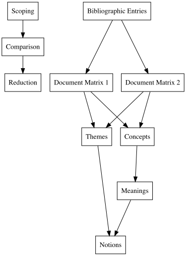

```{r setup, include=FALSE}
knitr::opts_chunk$set(
  echo = FALSE, # By default, hide code; set to TRUE to see code
  fig.pos = 'th', # Places figures at top or here
  out.width = '100%', dpi = 300, # Figure resolution and size
  fig.env="figure"
) # Latex figure environment

# install.packages("bibliometrix")
library(bibliometrix)

layout="l-body-outset"
library(rmarkdown)

options(knitr.table.format = "latex") # For kable tables to write LaTeX table directly
```

```{r, include=F, warning=F}
## set up, load libraries
library(dplyr)
library(readtext)
library(tidyverse)
library(here)
library(gt)
library(ggplot2)
library(dplyr)
library(knitr)
library(kableExtra)
here::i_am("alexander-examining-notions-of-racism-stem.Rmd")
```

**Unit title**: The Sciences, Medicine, and Technology

**Unit editors**: Ebony McGee, Evelynn M. Hammonds, Thema Monroe-White

**Intersection title**: Racism by Context

\newpage

# Abstract

This study explores the conceptual structure of a global body of research literature on racism in science, technology, engineering, and mathematics (STEM).
Using a quantitative historical framing, national anti-discrimination policies are identified to make sense of how racism is conceptualized across two citation databases consisting of research articles in STEM and STEM education journals.
The analysis reveals a rapidly evolving body of work that has incorporated an increasing focus on systemic issues across different national contexts.
As research on racism in STEM continues to extend the general understanding of individual-level attitudes and group behaviors in more local contexts, these particular sets of literature reveal related systems which operate across geographical and diverse educational, scientific, medical, and technological settings.
However, the conceptual notions of racism across databases differ in key terminology used to identify specific, systems-oriented issues that relate not only to the researcher's interests and methods but to the various scores applied to a document's lexical content.
Findings highlight disciplinary nuances in relation to scholars' theoretical approaches to examining racism and a resulting set of histories and keywords-in-context that drive computational systematic analyses.
Findings demonstrate the degrees of specificity and variation by discipline, reflecting unique approaches but related notions.

*Keywords*: STEM, racial, bibliometrics, citation, synthesis, race and ethnicity

\newpage

# Introduction

The use of diverse theoretical frameworks in research on science, technology, engineering, and mathematics (STEM) enhances the public's capacity to target the related but differing functions of racism within and beyond the STEM fields.
Although racism manifests in different ways, such as in attitudes and public policies, it is increasingly combated and understood through an extensive and growing body of scholarship that spans multiple disciplines and systemic foci [@bonilla2021], geographical regions [@solomos2022race], and topical areas [@Banaji_2021; @clair2015sociology].
Each of the disciplines in this broad body of work that examines racism take different routes to make sense of the the mechanisms through which racist systems, policies, and actions manifest.
Scholars' use of these different conceptual entry points and scientific methods to guide their analysis, as well as geographical considerations, raise questions about the application of standard computational frameworks to lead the analysis of an increasingly diversifying and niche but global body of scholarship.

We leverage studies from the social sciences and humanities to offer methodological insights into how research on racism has been collected and framed as a body of scholarship [@diebolt2001cliometric; @go2020race; @green2015sociology; @ojeh2024black; @shiao2021].
In the computational social sciences, for example, large-scale citation analyses are used to draw research from specific thematic indices and regions as found in an article's bibliographic content [@walker2018].
Academic resource databases like EBSCO and PubMed allow citations to be filtered by discipline and other features, such as keyword, region, and year; and, as a result, often produce different bibliometric analytic outputs that shift how scholars may frame or interpret a given body of literature [@alryalat2019comparing; @norris2007comparing; @vieira2009comparison; @wanyama2022you].
Moreover, it is not always clear through which channels this emerging scholarship on racism should be or is currently centered.
To understand the general body of scholarship on racism in STEM, this article engages insights from quantitative historical scholars to analyze a set of databases containing citation records on a global body of research on racism in STEM.
These insights contribute to a better conceptual understanding of a rapidly evolving body of scholarship and point to the conceptual variation present in databases developed specific to researcher's scope of analysis, geographical location, access issues, and propensity to cross disciplinary boundaries.

This article also examines how scholars in sociology have structured conceptualizations of racism through a set of different perspectives [@bonilla2001anything; @clair2015sociology; @shiao2021].
Despite key disciplinary differences, research on racism in STEM extends some of the general insights from the sociology research while offering new insights into a niche set of social, cultural, and educational contexts.
Our study acknowledges that the meanings attributed to racism by these scholars are shaped by dynamic indicators that evolve with ongoing field priorities [@abend2008meaning], such as where scholars search [@wanyama2022you], and to the potential effects of changes in laws and policies [@bertrand2024narrative] that may prompt new studies.
Many articles, however, consider a set of intersecting frameworks or approaches to racism that do not point to a single perspective or disciplinary function [@bonilla1997rethinking; @shiao2021].
In recognizing the varied meanings that scholars attribute to racism, questions still arise about the differing and intersecting perspectives that are prioritized by specific disciplines and subareas of study.

To explore these differences, we examine the conceptual and intellectual structure of research on racism in STEM and STEM education journals.
Specifically, we ask: *What is the intellectual and conceptual structure of research on racism in STEM, and what are the various notions—dominant, niche, and emerging themes—within this body of scholarship?* This study explores how racism is conceptualized and analyzed across different STEM disciplines, and hypothesizes a dynamic set of contemporary and historical indicators.
These indicators evolve as this collective body of scholarship extends the general understanding of racism while providing increasingly acute insights into specific settings.
This article frames the notions, or keywords-in-context, attributed to racism by a global network of scholars that will help identify indicators to guide researchers toward improved analyses, contributing to ongoing efforts to combat racism.

# Theoretical Frameworks

The increasingly diverse nature of research across the STEM disciplines, and the historical development and use of the term 'STEM' across geographical and theoretical boundaries [@hallinen2024], establishes a need to understand how discussions of racism have been codified in contemporary scholarship.
This global body of research represents a subset of two broader collections of studies: first, studies that focus on racism and, second, studies that center on science, technology, engineering, and mathematics.
We use the term notion to identify the syntactical structures and keywords used by researchers and we examine their diverse representations of racism [@bonilla2021].
For example, we explore scholars' use of the terms "structural racism" versus "systemic racism" and the related themes.
These related but different representations are extensions of conceptual and methodological inquiries that inform how different meanings are constructed.
Moreover, studies of bibliometric data in systematic reviews and meta-analytic studies require further engagement with the different analytic priorities by researchers across disciplinary areas.
We situate our engagements with three considerations: the dimensions of complexity in the social sciences, increases in specificity in studies of racism, and variations in the study of racism by discipline.
We begin with the quantitative historical framework to make sense of interrelated and overlapping dimensions in increasingly computational research communities.

## Quantitative History

Our entry point into the quantitative history framework is situated primarily around the units of study and documents of analysis, the methods used to analyze those documents, and the variation between these factors that inform findings in systematic reviews.
Quantitative history conceptualizes historical methods in the area of archival study and it has evolved to encompass diverse computational analyses that use various types of data [@haskins2011].
In the original disciplinary markers tied to quantitative historical study, economists and historians sought to make sense of various historical trends in larger scaled data sets [@furet1971].
These analyses included the collection, comparison, and modeling of data that, due to its potentially reductive nature, has only recently gained added traction for more critical engagement as a result of the recent advances in computational tools in the social sciences.

A secondary role of the quantitative history framework is to connect a systematic method to understand a rapidly evolving body of research literature on racism across multiple sub-fields of study.
Scholars in quantitative history take an interest in content specificity and variation [@furet1971; @Turchin_2017].
We take into account critiques of the often overly structured approaches used in bibliometric analysis to consider the specific conditions in STEM, and the potential connections between various lines of inquiry, that may inform differences in database development.
This framing is used to capture the breadth of scholarly work across different the different disciplinary and geographical boundaries in STEM, and provides a multiple pronged approach that captures the complexity, specificity, and variation within the scholarship that takes a specific approach to and leverages various conceptualizations of racism.
Notions, then, can be framed as a function of the various lexical patterns identified by the set of themes, keywords, and keywords-in-context used by authors.

Studies of racism in contemporary sociology offer many frameworks to describe the potential meanings of racial discrimination and racism [@small2020sociological].
As research on racism in science, technology, engineering, and mathematics (STEM) continues to gain traction [@mcgee2020interrogating], the dynamic developments and interdisciplinary perspectives leveraged by scholars across different disciplines require approaches that can capture the various conceptualizations, or concepts, used to frame racism.
In large-scale studies of citations, although dynamic representations of research literature may help map the increase in cross-disciplinary research and intersecting themes [@yang2006citation, @mott2017], they may fail to fully capture the dynamic discourses that occur within and across different research fields.
Still, large-scale analyses serve a role in the broader conceptualizations of racism, prompting additional studies at the intersection of theory and computational methods [@Garcia2018].

## Conceptualizations of Racism

The present study is motivated by the work of scholars who take note of the increasingly global nature of research on racism and the differences in emphasis between structure and process.
Ultimately, we build on the notes provided by @martin2024race, in an article on mathematics education, citing Essed & Goldberg (2022), who note that *racism* “is a *structure* because racial dominance exists in and is reproduced by the system through the formulation and applications of rules, laws, and regulations and through access to and the allocation of resources.
Finally, racism is a *process* because structures and ideologies do not exist outside the everyday practices through which they are created and confirmed.
These practices both adapt to and themselves contribute to changing social, economic, and political conditions in society” (@essed2001race, p. 185, emphases in original).
From a methods perspective, we build on @shiao2021 who analyze the meaning of racism in sociological journal content.

@shiao2021 build on @abend2008meaning to examine the meanings attributed to racism and they expand on the conceptualizations in @bonilla1997rethinking situated as (1) an "ultimately psychological phenomenon," (2) the "cultural processes [of an] all powerful ideology," and (3) "the foundation or structure of the social system," where he observes that sociologists typically conceptualize each meaning in less restrictive terms (p. 466-467).
@shiao2021 use a corpora of bibliometric data to make sense of research on racism in STEM.
In the present study, the topics across what is conceived as 'STEM' fail to provide a common framework for a singular analysis of scientific literature.
As the research on racism expands in STEM, the use of various concepts in relation to racism offers important insights.
These insights can be understood through an analysis of how scholars discuss the study of racism.

@shiao2021 note that the "decision to connect concepts across the divide between comparative ethnicity and critical race theory may be controversial, but [they] find the general terminology of comparativists to be helpful for differentiating among uses of racism as structure and integrating the historical and group-specific analyses of U.S. critical race scholars" (p. 3). With these divides in mind, the two frameworks of racism presented by @bonilla1997rethinking and @shiao2021 were used to guide the conceptual replication for the study. @bonilla2021 notes that "Theorists must respond to critics, address new data, allow for new ideas, concepts, and orientations to affect their work, and, once in a while, fine-tune or even change their concepts altogether. Otherwise, they engage in the pathology of unconditionality Nietzsche (rightly so) detested." (p. 513). @bonilla2021 continues with the note that "...racism is material both in terms of practices (the mechanisms and behaviors enacted by actors that reproduce racial inequality) and in terms of actors' interests" (p. 516-517). One example of these interests that are clearly laid out in a historical view of sociology is Du Bois' intellectual inquiries [@Besek2021] focused on racism, where he examines the various complex dimensions of social conditions surrounding race and racism [@shuford2017four].

The outlines provided by Bonilla-Silva (1997) and Shiao and Woody (2021) situate the lenses to examine research on racism in STEM.
The emphasis on the multifaceted nature of racism, encompassing individual attitudes, cultural processes, and structural elements, highlights the importance of understanding racism as a social structure, while Shiao and Woody's framework further delineates this into pre-existing consequential inequalities and processes that create or maintain racial dominance.
In our study, we observed how these various components manifest in STEM research.
Individual attitudes were evident in studies examining personal biases among STEM professionals and students.
Cultural processes and schemas emerged in research exploring shared beliefs and stereotypes within STEM disciplines.
The structural aspects were particularly prominent in studies investigating institutional policies and practices that perpetuate racial disparities in STEM education and careers.
By applying these frameworks to our analysis, we were able to categorize and interpret the diverse body of research on racism in STEM, revealing the complex interplay between psychological phenomena, cultural influences, and structural factors that contribute to racial inequities in these fields.

**[Insert table: Frameworks on the conceptualizations and meanings of racism]**

+--------------------------+---------------------------------------------------------------+
| **Bonilla-Silva (1997)** | **Shiao and Woody (2021)**                                    |
+--------------------------+---------------------------------------------------------------+
| Psychological phenomena  | Attitudes                                                     |
+--------------------------+---------------------------------------------------------------+
| Cultural processes       | Cultural schema                                               |
+--------------------------+---------------------------------------------------------------+
| Social structure         | Structure: Pre-existing consequential inequalities            |
+--------------------------+---------------------------------------------------------------+
|                          | Structure: Processes that create or maintain racial dominance |
+--------------------------+---------------------------------------------------------------+

: **Table 1**: Frameworks on the conceptualizations and meanings of racism

## Complexity, Specificity, and Variation

The research in critical sociology suggests that historical data alone may not adequately reflect the evolving nature of racism, which manifests in subtle and well-understood ways that are difficult to quantify.
This critique underscores the importance of complementing quantitative historical approaches with qualitative methods and perspectives to gain a better understanding of the niche, more comprehensive understandings of how racism functions and evolves.
In a set of less well-known "Du Boisian" approaches [@hughey2023boisian; @monteiro2000being; Ojeh, -@ojeh2024black; @shuford2017four], Black sociologists outline both critiques of and methodological opportunities for a dynamic investigation of racism as it relates to specific historical contexts across disciplines.
These scholars observe how conceptions of race and racism contribute to both connected and specialized understandings that balance scholars' use of broader ideas, terms, and keywords with their analysis of these concepts in specific contexts.
Du Bois is recognized as one of the early critical scholars of race who contributed to this dual approach in sociological study and he is regarded as one of the founding fathers of sociology [@ojeh2024introduction].
Du Bois himself was an interdisciplinary scholar who also integrated computational methods into sociological research during his early development [@Besek2021; @monroewhite2022].

@Besek2021 note that "Du Bois directly reflected upon this interdisciplinary approach in an essay that remained unpublished until the first year of the twenty-first century [@du2000sociology; @go2020race] entitled 'Sociology Hesitant', which provides a window into how he fit his cautiously realist picture of science within his own sociological practice. Its title refers to a contemporary identity crisis in sociology, one derived from open questions regarding what sociology is per se, what sociologists should actually be doing, and how sociology should relate to other, more established, disciplines," citing Du Bois, that "[sociologists] had been heretofore 'hesitant' to acknowledge the limits of sociology – that it will never be an exact science and that 'this is a world of Chance as well as Law'" (p. 7-8).
Some of these extensions relate to ongoing critiques in sociology regarding the conceptual and methodological approaches to inequality, social systems and processes, and structures.
Despite our analysis of and reliance on the ways that sociologists and the body of work in sociology focus on racism, we take into account these dynamic shifts.
@green2015sociology, for example, provide a related discourse around scholars' ongoing neglect of Du Bois' body of scholarship, especially within the domain of sociology, which focused increasingly on the various systems through which the conceptions of race and racism developed by Du Bois would service the broader field of sociological research.

Ojeh [-@ojeh2024black], following @wright2020jim, refines a subset of contemporary studies of sociology within the frame of a "Black sociology," where the analysis of systems and social power are rooted more deeply in the foundations of the Atlanta Sociological Laboratory (ASL) at Atlanta University.
In this analysis, Ojeh [-@ojeh2024black] provides an extension to the field's understanding of Black sociology as a distinct area of study, a specificity within sociology, using seven principles: "(1) Defines Black sociology as the scientific analysis of systems of oppression and social power; (2) Avoids race deficit approaches derived from mainstream sociology; (3) The research centers on the experiences of Black Americans and people of African descent throughout the Diaspora; (4) The research implements an interdisciplinary and community-based approach; (5) Research about Black people is understood as contextually valid and valuable to scientific research; (6) Scholars use their scholarship to promote social change through social policy and practitioner engagement; (7) The research is conducted by scholars who implement a Black sociological standpoint" (p. 39).
Ojeh's conceptual approach contributes to our understanding of complexity in the general study of racism as examined by social structures and processes.
This conception, at the intersection of race and racism, is an extension of sociological thought articulated in other studies related to different groups, such as anti-Asian racism [@yu2024dissecting], research on racial equity research and Indigenous communities [@gordon2024understanding], and related studies on the dynamic shifts in studies of racism [@neville2024shifting].
These diverse perspectives underscore the need for a comprehensive methodological approach to analyze the complex landscape of research on racism across disciplines.

# Methods and Data

Systematic review techniques offer a structured approach to synthesizing research literature [@diebolt2001cliometric].
New computational methods have significantly advanced systematic reviews, helping with more pre-defined protocols outlining the methodologies that should be undertaken for reproducibility.
These approaches employ a comprehensive, detailed search strategy across multiple databases and sources to find relevant studies.
Systematic reviews also utilize specific, pre-defined inclusion and exclusion criteria for studies, whereas more critical reviews may rely on subjective or seemingly unclear selection criteria due to content- or disciplinary-specific knowledge.
This often ignored but critical aspect of systematic reviews requires a rigorous assessment of its contribution to and limitations around study quality and risk of bias.
The quantitative historical analytic lens is used to examine how @shiao2021's framework maps onto racism-related research in STEM.
We map the intellectual structure of racism-focused research in STEM and STEM education journal articles and model similarities across database samples.

Despite the increasing value of systematic analysis, there are fewer replication studies conducted in certain scientific disciplines, one being research in education [@perry2022decade].
In studies on replication methods, the focus on the value of certain methodological insights is presented and challenged.
For example, @bonett2021design focus on the various criteria needed in replication studies, confirming the research conducted by @anderson2016there and @perry2022decade that direct replications are rare.
While focusing on the various quantitative and computational facets of replication studies, @bonett2021design's analysis provides insights into the dynamic nature of replication studies and the increasing requirements of computational methods for replication.
@perry2022decade review replication studies in education between 2011 and 2020.
In their analysis, they examine the number of replications and types of replication studies conducted.
@perry2022decade note that many studies in education research are conceptual in nature, and that direct replication studies are rare in the discipline of education.
Each of these studies contributes to our broader engagement with large-scale bibliometric content in education and the development of a more diverse approach to examining the evolution and development of ideas in a field.

## Method

Our study used the bibliometrix package in R/Posit [@aria2017bibliometrix] as the primary analytical tool, combining traditional bibliometric analysis with quantitative historical methods.
Traditional bibliometric analysis, as facilitated by bibliometrix, focuses on the quantitative assessment of scholarly publications, including citation patterns, authorship networks, and journal impact factors.
It aims to evaluate research productivity, influence, and trends within specific disciplines or research communities.
However, we extended this approach by incorporating quantitative historical methods, and specifically frameworks that consider the complexity, specificity, and variation of database content, to uncover and analyze patterns in the selected document matrices based on the study's conceptual framework.

The bibliometrix package enabled us to conduct an extended analysis not traditionally used in systematic reviews, considering the role of research on racism in broader social and cultural academic contexts.
This approach supported the inclusion of research across axes that tackle context and increased specificity and variation, which can result in somewhat of a "black box" of information in niche areas of expanding global studies.
By utilizing bibliometrix's advanced features, we were able to overcome limitations of traditional bibliometrics, which may overlook contributions based on the tendency to examine developments and differences within a single field of study.
This comprehensive method allowed us to capture the nuanced landscape of racism research in STEM across multiple disciplines.

### Analytic Framework

The analytic framework for the study was an iterative process that included insights from quantitative historical methods [@haskins2011], elements from bibliometric analytic methods [@aria2017bibliometrix], systematic reviews [@crisp2024systematic], and qualitative meta-synthesis methods in mathematics and education [@berry2013promise; @thomas2019qualitative; @thunder2016].
Given that the research on racism in STEM draws from a more diverse set of intersecting disciplinary sources, our study departs from the methods outlined in @shiao2021 (2021) and adopts some of the methods engaged in the systematic processes in related studies in education on critical content.
In our study, we focus on the distribution of research across domains and our process of extracting information from bibliographic entries and citations to examine the meaning of racism in STEM.

**[Insert figure: analytic-framework]**



At the intersection of bibliometrics and quantitative historical methods is a common ground in the utilization of records to derive insights and draw conclusions on the contents of large-scale data.
Both approaches employ methodologies that examine database information in order to uncover various patterns and syntactical structures of citation data content.
The two frameworks diverge in their primary objectives, however, by the nature of their respective goals and foundations.
As noted by @shiao2021, these analytic choices by discipline hold benefits and limitations to the advancement of further intellectual inquiry.

## Data

### Scoping and comparison

This study follows suggestions by scholars [@aksnes2019criteria; @alryalat2019comparing; @Antons_2021; @birkle2020web; @garcia2010keyword] and began with four major databases to identify and compare collections of sources: EBSCO, Scopus, Google Scholar, and Web of Science (WoS).
EBSCO, a leading provider of research databases, offers specialized resources like ERIC for education research.
Scopus, known for its comprehensive coverage across academic fields, provides advanced search capabilities and journal metrics.
Google Scholar, a free academic search engine, indexes a broad range of scholarly literature without a peer review process for inclusion.
Web of Science, a highly respected citation database, was used for its Core Collection of bibliometric data.

*EBSCO*. As one of the leading providers of research materials, EBSCO (Elton B. Stephens Company) initially sold magazines and military supplies but has now become one of the largest providers of research databases for libraries and academic institutions.
For this study, a subset of databases were selected that followed the work of other scholars [@thunder2016].
The databases were: Academic Search Premier, Social Sciences Full Text (H. W. Wilson), Education Research Complete, ERIC, and APA PsychArticles and APA PsychInfo Collection.
For example, ERIC (Education Resources Information Center) is a specialized database for education research, providing access to over 1.6 million texts related to all aspects of education.
It is sponsored by the U.S.
Department of Education and is considered the largest database for education literature.

*Scopus*.
Scopus is one of the leading abstract and citation databases that covers multiple academic fields and is considered a comprehensive resource for academic researchers.
It covers scientific journals, books, and conference proceedings across various areas of study.
It provides journal metrics and advanced search capabilities that can be used to identify specific areas of study.
Scopus is also integrated with other research tools and software to facilitate large-scale analysis.
There have been some studies of Scopus in comparison to the other selected databases, see @vieira2009comparison.

*Google Scholar*.
As part of Google's broader universe, Google Scholar is one of the most widely used free academic search engines.
The search engine indexes a range of scholarly literature across multiple disciplines and does not include a peer review process for inclusion, unlike some other academic databases.
As a result, it is considered one of the more comprehensive academic search engines, containing one of the largest collections of scholarly materials.
Google Scholar's broad scope allows researchers to access a wide variety of academic content, including journal articles, conference papers, theses, dissertations, and books from various fields of study.

*Web of Science (WoS)*.
Web of Science (WoS) is a comprehensive and highly respected citation database used for scholarly research.
It is one of the main databases used to identify and compare collections of citations and bibliographic sources.
Given the conceptual replication method selected for this study, we utilized the Web of Science Core Collection of bibliometric data.
This decision provided us with an opportunity to understand differences across disciplinary boundaries [@Takeuchi_2020], despite the increasingly interdisciplinary nature of research on racism in STEM.
Prior studies have analyzed differences between Google Scholar and WoW [@mikki2009google; @norris2007comparing].
Unlike Google Scholar, the Web of Science Core Collection offers access to multiple citation indexes, covering a wide range of academic disciplines and publication types, making it an ideal resource for data collection and analysis.

**[insert table: Results of title keyword search]**

+---------------+------------+--------------------+------------+--------------------+
| **Keyword**   | **EBSCO**  | **Google Scholar** | **Scopus** | **Web of Science** |
+===============+:==========:+:==================:+:==========:+:==================:+
| anti-racism   | 381        | 3,420              | 685        | 592                |
+---------------+------------+--------------------+------------+--------------------+
| anti-racist   | 427        | 3,620              | 826        | 685                |
+---------------+------------+--------------------+------------+--------------------+
| race          | 44,057     | \~313,000          | 65,203     | 69,537             |
+---------------+------------+--------------------+------------+--------------------+
| racial        | 24,467     | \~212,000          | 39,930     | 41,527             |
+---------------+------------+--------------------+------------+--------------------+
| racialization | 519        | 2,740              | 1,108      | 1,077              |
+---------------+------------+--------------------+------------+--------------------+
| racialized    | 958        | \~5,600            | 1,863      | 2,120              |
+---------------+------------+--------------------+------------+--------------------+
| racism        | 8,669      | \~99,500           | 11,418     | 10,674             |
+---------------+------------+--------------------+------------+--------------------+
| racist        | 1,965      | \~15,100           | 2,170      | 1,906              |
+---------------+------------+--------------------+------------+--------------------+

: **Table 2**: Results of title keyword search[^1]

[^1]: Reported results obtained on July 16, 2024; search for titles containing keyword patterns.

An iterative scoping process was followed to make sense of the various database options and document structures.
The comparisons that followed were used to differentiate the contents of each potential data set.
Four databases were used to identify the possible collections of sources and to compare the various results obtained.
Using multiple databases provides a more complete comparative picture of the available literature, as each database has different coverage and indexing practices.
This approach also presents an opportunity to examine differences across variations in terminology [@garcia2010keyword].
In some search engines, the use of the asterisk \* serves as a placeholder for one or more characters.
This allows researchers to find variations of terms efficiently; for example, searching "racis" would return results including "racist" and "racism" [@park2011keyword].
This functionality is particularly useful in literature reviews and when exploring interdisciplinary topics.
Table 2 presents the results for the keywords across their related keyword patterns.

### Reduction

Data reduction took place in three steps.
The first reduction occurred in the scoping process where articles were reviewed for containing complete bibliometric records.
In this step, JSON files of the citation records were entered into the Quanteda [@benoit2018quanteda] R/Posit software package, which summarized the sources of any incomplete records.
The second reduction occurred in the comparison step where any results that did not fit the requirements outlined in the inclusion and exclusion criteria, following traditional bibliometric analysis methods, were excluded.
The third and final reduction occurred in the comparison step where articles were reviewed for their fit within the goals of the study.
In this step, any articles not found during the initial two steps and any ancillary results that were returned were excluded.
This resulted in a set of bibliometric records across the two initial samples for the study.

The protocol outlined in the PRISMA [@page2021prisma] flow diagram was used to consider a more critical analysis in informing our analytic methods.
We adapted this approach to examine the reduction of records across the two sets, but our method diverged significantly from the standard PRISMA guidelines.
Our reduction method integrated a critical analysis of data loss and considered the various ways that contemporary methods may not include specific articles.
This tailored approach allowed us to maintain a more flexible and nuanced examination of the literature, taking into account the unique challenges and complexities of studying racism in STEM fields.
By only marginally adhering to the PRISMA guidelines, we were able to develop a more context-specific methodology that better suited the interdisciplinary nature of our research question and the diverse body of literature we encountered.

The final inclusion criteria for this study were developed by an extension of the iterative analytic system used in the scoping process.
This approach allowed for a more nuanced consideration of the evolving nature of racism research in STEM fields.
Rather than adhering to a traditional table of fixed criteria, our method involved a dynamic process of sample identification and refinement.
Two distinct samples were identified through this process.
The first sample consisted of articles from STEM education journals, the second from STEM journals, and a third and final data set was an integrated sample combining the previous two document matrices with all duplicates removed.
All studies were published within the twenty year period between 2003 and 2023.

The iterative nature of our analysis meant that inclusion and exclusion decisions were made based on a combination of factors, including relevance to the research questions, alignment with @shiao2021's framework, and the article's contribution to understanding racism in STEM contexts.
Instead of a static table, our inclusion and exclusion process was documented through a series of analytical memos and decision logs.
This method aligns with the quantitative historical framework by acknowledging the contextual nature of research evolution and allowing for a more flexible approach to sample selection.
It also enabled us to critically examine potential data loss and consider articles that might have been overlooked by more rigid, traditional methods.
This approach, while departing from conventional systematic review practices, provided a richer, more comprehensive view of the landscape for examining the complex and evolving discourse on racism in STEM fields.

## Limitations

Our study has several limitations that should be acknowledged.
As @Turchin_2017 note, quantitative approaches in historical analysis have been criticized for potentially focusing too narrowly on numerical aspects and failing to capture the full complexity of the subject matter.
This critique is relevant to our study given the diverse collection of disciplines and foundations examined.
The interdisciplinary nature of research on racism in STEM presents a challenge, as scholarship at this intersection is parsed across multiple disciplinary boundaries and domains of study.
While our conceptual replication of @shiao2021's study aims to examine how various notions of racism in STEM relate to major constructions of racism identified in sociology, it may not fully capture the nuances within each STEM discipline.
Our integrated approach, combining quantitative historical and bibliometric analytic techniques, allows for a broad examination of historical phenomena and related concepts in the study data.
However, this method may overlook some context-specific details that could be crucial in understanding the full scope of racism in STEM.

Furthermore, while bibliometric analysis provides valuable insights into scholarly texts and their representations, it may not fully capture the qualitative aspects of the research or the lived experiences behind the studies.
The reliance on published academic literature also means that important perspectives from non-academic sources or unpublished work may be missed.
As noted by @alryalat2019comparing and @yang2006citation, there is an ongoing need to consider extensions to traditional bibliometric analyses.
Our study, while attempting to address some of these concerns, may still be limited by biases in final database inclusion, keyword choices and priorities, and the evolving nature of our focal points on the terminology centered based on how it is related to researchers' framings of racism in academic discourse.

# Findings

To navigate the expanding research literature and intersecting areas of study, we examined the distribution of research on racism in STEM with a comprehensive review of the various database options to search and retrieve published scholarly studies.
Among these, the Web of Science (WoS) emerged as our primary source due to its status as one of the most widely-expanding citation databases used by researchers and as a result of the conceptual replication.
WoS is frequently compared to other well-known citation databases and networks such as Google Scholar, PubMed, and Scopus.
This broad-based approach allowed us to capture a diverse range of academic disciplines contributing to the discourse on racism in STEM fields.

Overall study results indicate that research on racism in the STEM disciplines varies by disciplinary network but not necessarily by the associated content.
Despite the charge to examine more systemic forms of racism, the samples are primarily inclusive of research on two of the three constructs: individual attitudes and cultural schema, and relate to those findings outlined in @shiao2021.
Three distinct citation-based communities were identified across the full sample, which revealed a hidden community that would not have been found without the quantitative historical framing.
Additionally, there was a change in the variance of the network citation metrics when themes were varied.

## Document Matrix Summaries

Each document matrix, represented by \$M\$, included a different number of observations over a total of 61 variables.
Each document matrix served as a fundamental structure for organizing and analyzing the bibliometric data across different journal sources.
A matching method was used to identify and remove all duplicate records.
In our coding schema for the reduction, when duplicate records were noted, a new data frame was generated and used as the main object.

Document matrix 1 (M1, n = 245) includes the records from education journals, while document matrix 2 (M2, n = 113) includes those records from STEM and non-education journals.
These distinct matrices (M1 and M2) allowed for comparative analysis between education-specific and broader STEM research on racism.
The combined matrix (M3, n = 351) was created by merging M1 and M2.
This matrix-based approach facilitated efficient data management and enabled us to perform specialized analyses on different subsets of the literature while maintaining the ability to examine the corpus as a whole.

```{r, include=F, warning=F}
### Load and convert data
# load wos database results
library(readr)
edrecords <- readtext(here("final-sample-ed.txt"))
# https://www.webofscience.com/wos/woscc/summary/331dedce-0c5c-40cd-b63e-734077ea3736-f840d6cf/relevance/1

stemrecords <- readtext(here("final-sample-stem.txt"))
# https://www.webofscience.com/wos/woscc/summary/507ef07d-4440-43c5-a139-c3148bf75a7f-f8416bcd/relevance/1

combined <- rbind(edrecords, stemrecords)

# convert  file to a bibliometric df
M1 <- convert2df(file=edrecords, dbsource= "wos", format= "plaintext")
M2 <- convert2df(file=stemrecords, dbsource= "wos", format= "plaintext")
M3 <- convert2df(file=combined, dbsource= "wos", format= "plaintext")
```

```{r, include=F, warning=F}

# We used the `duplicatedMatching()` function and [code suggestion](https://rdrr.io/github/massimoaria/bibliometrix/man/duplicatedMatching.html) to test for and remove any duplicate records in the data. When duplicate records are noted, the data new data frame is used as the main object.

M1_dup <- duplicatedMatching(M1, Field = "ID", exact=FALSE, tol = 0.95)
dim(M1)
dim(M1_dup)
  
M2_dup <- duplicatedMatching(M2, Field = "ID", exact=FALSE, tol = 0.95)
dim(M2)
dim(M2_dup)

M3_dup <- duplicatedMatching(M3, Field = "TI", exact=FALSE, tol = 0.95)
dim(M3)
dim(M3_dup)

# the package developer noted that when using `duplicatedMatching` we get missing data that is required later in the analysis. I have worked around this issue by changing the Field from "TI" to "ID". While this tempoararily supports the analysis, a fix should be found to retain the bibliometric data from the ID columns as downloaded from WoS.

# There was an issue with the code, so it was fixed using the `janitor()` functions.
library(janitor)
compare_df_cols(M1, M1_dup)
compare_df_cols(M2, M2_dup)
compare_df_cols(M3, M3_dup)

# in an earlier analysis, a column was added to the data sets (CR_SO)
# M1_dup <- M1_dup %>% remove(CR_SO) %>% as.data.frame()
# M2_dup <- M2_dup %>% remove(CR_SO) %>% as.data.frame()
```

**[Insert table: database record counts and labels]**

| **Database** | **Complete Records** | **Columns** |  **Label**  |
|:-------------|:--------------------:|:-----------:|:-----------:|
| M$_1$        |         245          |     61      |  edrecords  |
| M$_2$        |         113          |     61      | stemrecords |
| M$_3$        |         351          |     61      |  combined   |

: **Table 3**: Database record counts and labels.

The combined matrix (M3), formed by merging M1 and M2, served as the primary dataset for all subsequent analyses in the study.
This comprehensive matrix allowed us to examine the full spectrum of research on racism in STEM, encompassing both education-specific and broader STEM literature.
By using M3, we were able to conduct more robust analyses, including the identification of citation-based communities, examination of keyword patterns, and exploration of interdisciplinary connections.
M3 facilitated the application of our quantitative historical framework across the entire set of studies, revealing insights into the current intellectual structure and state of research on racism in STEM.
The 351 articles in Document Matrix 3 come from a total of 181 sources and contain a total of 1,060 authors.
Annual scientific production has sharply increased, with the largest increase occuring after the global pandemic, where production went from 26 articles in 2020 to 87 articles in 2022.
However, average citations per year have decreased across the studies, with 2.1 average citations in 2022 and 0.9 in 2023; which are down from a peak average citations per year of 18 in 2009.
The documents in the matrix have a document average of 3.9 years with an annual growth rate of 14.4 percent.

## Distribution of Research

Our analysis of the various distributions of the research on racism in STEM revealed a significant concentration in education and the education sciences, and studies of public health in STEM journal outlets.
This concentration highlights the interdisciplinary nature of studies on racism while also pointing to different densities by disciplinary area.
The dominance of these fields suggests that they have been at the forefront of addressing issues of racism within STEM contexts, potentially due to the increasing focus on social issues and systemic inequalities in these domains.
However, this concentration also raises questions about the engagement of other STEM disciplines in addressing racism within their respective fields.
The following sections provide a more detailed breakdown of this distribution and its implications for the broader landscape of racism research in STEM.

### Global distribution

Based on a total of 351 studies on racism in STEM, the global distribution of research reveals a significant concentration in a few countries, with only the top ten countries reported.
The United States dominates the field, accounting for 76.4% of the studies (268 out of 351).
The United Kingdom and Canada follow distantly, contributing 3.4% (12 studies) and 3.1% (11 studies) respectively.
Brazil ranks fourth with 2.3% (8 studies), while Australia accounts for 1.4% (5 studies).
New Zealand and South Africa each contribute 1.1% (4 studies each).
China represents 0.9% (3 studies), while Colombia and France each account for 0.6% (2 studies each).
The concentration of 90.9% of the reported studies in these ten countries suggests a need for more diverse global perspectives and increased research efforts in other regions to provide a more comprehensive understanding of the issue globally.
It's important to note that 9.1% of the studies are distributed among countries not listed in the top ten, indicating some degree of global engagement beyond these primary contributors.

**[Insert table: Publication count and rank by country]**

+----------------+-------------+-------------+--------------+
| **Country**    | *Rank*      | *Count*     | *% of total* |
|                |             |             |              |
|                |             |             | (n = 351)    |
+----------------+-------------+-------------+--------------+
| USA            | 1           | 268         | 76.4         |
+----------------+-------------+-------------+--------------+
| United Kingdom | 2           | 12          | 3.4          |
+----------------+-------------+-------------+--------------+
| Canada         | 3           | 11          | 3.1          |
+----------------+-------------+-------------+--------------+
| Brazil         | 4           | 8           | 2.3          |
+----------------+-------------+-------------+--------------+
| Australia      | 5           | 5           | 1.4          |
+----------------+-------------+-------------+--------------+
| New Zeland     | 6           | 4           | 1.1          |
+----------------+-------------+-------------+--------------+
| South Africa   |             | 4           | 1.1          |
+----------------+-------------+-------------+--------------+
| China          | 8           | 3           | 0.9          |
+----------------+-------------+-------------+--------------+
| Columbia       | 9           | 2           | 0.6          |
+----------------+-------------+-------------+--------------+
| France         |             | 2           | 0.6          |
+----------------+-------------+-------------+--------------+

: **Table 4:** Publication count and rank by country

The significant overrepresentation of U.S.-based research in this dataset can be attributed to several factors.
Many leading journals in STEM fields and education research are based in the United States, which may lead to a higher representation of U.S. scholars and studies in these publications.
The U.S. also has a large number of well-funded research institutions and universities actively engaged in STEM education research.
The country's historical leadership in STEM fields, coupled with ongoing efforts to address diversity and inclusion issues, likely contributes to the high volume of studies on racism in STEM originating from U.S. researchers.
Additionally, the U.S. has a long-standing tradition of addressing racial issues in academic discourse, which may result in more studies focused on this topic compared to countries where such discussions are less prevalent or only recently emerging.
The use of English as the primary language of publication in many international journals may also favor contributions from English-speaking countries, particularly the United States.
These factors combine to create an environment where U.S.-based research dominates the discourse on racism in STEM, potentially limiting the diversity of perspectives and approaches to addressing this global issue.

## Thematic and concept analysis

The keywords and thematic clusters underscore the multifaceted nature of research on racism in STEM, spanning issues of identity, education, gender, and various psychological factors.
The varying centrality scores of these clusters suggest different levels of research focus and interconnectedness within the field.
This thematic distribution can be further distilled to provide additional insights into the current state of the research on racism in STEM.

### Clusters

The analysis of research on racism in STEM reveals five distinct thematic clusters, each characterized by key concepts and focus areas.
The first theme centers around "identity," "critical race theory," and "African-American," comprising 45 studies with a centrality score of 0.251.
The second theme, focusing on "education," "students," and "experiences," is the largest cluster, containing 83 studies and a centrality score of 0.390.
The third theme, which emphasizes "race," "students," and "gender," includes 74 studies and has the highest centrality score of 0.548, indicating its central position in the network.
The fourth theme, highlighting "science," "gender," and "color," consists of 38 studies with a centrality score of 0.367.
Lastly, the fifth theme, which encompasses "racism," "psychology," and "age," is the smallest cluster, comprising only 10 studies and having the lowest centrality score of 0.187.

**[Insert table: thematic map-callon centrality]**

+------------------+-------------------+----------------+-----------------+--------------+-------------------+
| Cluster          | Callon Centrality | Callon Density | Rank Centrality | Rank Density | Cluster Frequency |
+==================+===================+================+=================+==============+===================+
| race             | 15.421            | 52.913         | 28              | 18           | 798               |
+------------------+-------------------+----------------+-----------------+--------------+-------------------+
| African American | 6.184             | 54.222         | 27              | 19           | 160               |
+------------------+-------------------+----------------+-----------------+--------------+-------------------+
| equity           | 4.550             | 54.312         | 26              | 20           | 162               |
+------------------+-------------------+----------------+-----------------+--------------+-------------------+
| risk             | 2.628             | 69.769         | 25              | 28           | 35                |
+------------------+-------------------+----------------+-----------------+--------------+-------------------+
| responses        | 1.292             | 43.750         | 24              | 7            | 6                 |
+------------------+-------------------+----------------+-----------------+--------------+-------------------+
| politics         | 1.069             | 62.500         | 22.5            | 24           | 11                |
+------------------+-------------------+----------------+-----------------+--------------+-------------------+
| disparities      | 1.069             | 16.667         | 22.5            | 1            | 6                 |
+------------------+-------------------+----------------+-----------------+--------------+-------------------+
| exercise         | 1.000             | 62.500         | 21              | 24           | 4                 |
+------------------+-------------------+----------------+-----------------+--------------+-------------------+
| management       | 0.944             | 38.889         | 20              | 6            | 6                 |
+------------------+-------------------+----------------+-----------------+--------------+-------------------+
| gay              | 0.917             | 36.111         | 19              | 5            | 13                |
+------------------+-------------------+----------------+-----------------+--------------+-------------------+

: **Table 5**: Cluster anlaysis

The specific keywords in the table have been ranked according to their Callon centrality, a measure used in co-word analysis to assess the importance of a term within a research field.
Callon centrality quantifies the strength of a keyword's connections to other keywords in the network.
A higher centrality score indicates that the keyword plays a more central role in connecting different themes or concepts within the field.
We chose to rank by Callon centrality to highlight the keywords that are most influential in bridging various topics in the research on racism in STEM, providing insight into the core concepts that link different aspects of this multifaceted field of study.

### Keywords-in-context

In our analysis of the keywords, we examined both the conceptual and intellectual structure of the research literature found in the combined data set.
To display the conditions of complexity, specificity, and variation previously discussed, we analyzed a host of combinations to target differences in the databases.
In Table 6, we outline a sample analysis of keywords-in-context and the further refining process that would inform a qualitative metasynthesis [@berry2013promise; @thunder2016].

```{r, include=F, warning=F}
# Install and load required packages
# install.packages(c("quanteda", "readxl", "dplyr"))
library(quanteda)
library(readxl)
library(dplyr)

# Read the Excel file
data <- read_excel("m3.xlsx")

# Check the structure of the data
str(data)

# 'AB' is the column containing the abstracts
# If it's a different column, replace 'AB' with the correct column name
text_data <- data$AB

# Ensure text_data is character
text_data <- as.character(text_data)

# Remove any NA values
text_data <- text_data[!is.na(text_data)]

# Create a corpus and tokens
corpus <- corpus(text_data)
tokens <- tokens(corpus)

# Perform KWIC analysis
# Replace 'keyword' with the specific word or phrase you want to analyze
keywords <- c("structural", "sytemic", "antiblackness", "racist", "racial")
structure <- c("structural")
system <- c("systemic")
antiblackness <- c("antiblackness", "anti-blackness")

kwic_results <- kwic(tokens, pattern = phrase(keywords), window = 5)
kwic_structure <- kwic(tokens, pattern = phrase(structure), window = 5) 
kwic_system <- kwic(tokens, pattern = phrase(system), window = 5) 
kwic_antiblackness <- kwic(tokens, pattern = phrase(antiblackness), window = 5) 

# View the results
print(kwic_results)
print(kwic_structure)
print(kwic_system)
print(kwic_antiblackness)

# Count occurrences per document
doc_counts_results <- table(kwic_results$docname)
doc_counts_results

doc_counts_structure <- table(kwic_structure$docname)
doc_counts_structure

doc_counts_system <- table(kwic_system$docname)
doc_counts_system

doc_counts_antiblackness <- table(kwic_antiblackness$docname)
doc_counts_antiblackness

# Convert to a data frame for easier viewing
doc_counts_results_df <- as.data.frame(doc_counts_results)
colnames(doc_counts_results_df) <- c("Document", "Occurrences")

doc_counts_structure_df <- as.data.frame(doc_counts_structure)
colnames(doc_counts_structure_df) <- c("Document", "Occurrences")

doc_counts_system_df <- as.data.frame(doc_counts_system)
colnames(doc_counts_system_df) <- c("Document", "Occurrences")

doc_counts_antiblackness_df <- as.data.frame(doc_counts_antiblackness)
colnames(doc_counts_antiblackness_df) <- c("Document", "Occurrences")

# Sort by number of occurrences in descending order
doc_counts_results_df <- doc_counts_results_df[order(-doc_counts_results_df$Occurrences), ]
doc_counts_structure_df <- doc_counts_structure_df[order(-doc_counts_structure_df$Occurrences), ]
doc_counts_system_df <- doc_counts_system_df[order(-doc_counts_system_df$Occurrences), ]
doc_counts_antiblackness_df <- doc_counts_antiblackness_df[order(-doc_counts_antiblackness_df$Occurrences), ]

# Print the counts
print(doc_counts_results_df)
print(doc_counts_structure_df)
print(doc_counts_system_df)
print(doc_counts_antiblackness_df)

doc_counts_results_df %>% 
  count(Occurrences)

doc_counts_structure_df %>% 
  count(Occurrences)

doc_counts_system_df %>% 
  count(Occurrences)

doc_counts_antiblackness_df %>% 
  count(Occurrences)

```

+--------------------------------------+---------------+-----------+
| Keyword-in-context                   | Documents     | Frequency |
+======================================+===============+===========+
| c("structural")                      | 8             | 60        |
+--------------------------------------+---------------+-----------+
| c("systemic")                        | 68            | 96        |
+--------------------------------------+---------------+-----------+
| c("antiblackness", "anti-blackness") | 9             | 11        |
+--------------------------------------+---------------+-----------+

**Table 6**: Document count and frequency of sample keywords-in-context in M3 database.

# Discussion

Our analysis revealed that in the top ten studies cited across each of the data sets, the concept of racism encompasses multiple conceptualizations, aligning with different components of the frameworks proposed by @bonilla1997rethinking and @shiao2021.
These domains include individual attitudes, cultural schema, preexisting consequential inequalities, and processes that create or maintain racial dominance.
Individual attitudes refer to personal biases and prejudices held by individuals within STEM fields.
Cultural schema involves shared beliefs and stereotypes about racial groups in STEM contexts.
Preexisting consequential inequalities pertain to established racial disparities in STEM education and career opportunities.
Lastly, processes that create or maintain racial dominance involve systemic practices and policies that perpetuate racial inequities in STEM.

This study employed an integrated systematic approach through a complexity, specificity, and variation framing yielded insights into the landscape of racism research in STEM.
The application of this framework to our analysis of two distinct data sets has revealed both the intricacies and nuances inherent in this critical field of study.
The results of our investigation demonstrate a high degree of complexity within the research on racism in STEM.
This complexity is evident in the multifaceted nature of the studies examined, reflecting the intricate interplay of social, institutional, and individual factors that contribute to racial disparities in STEM fields.
Our analysis uncovered a rich tapestry of research approaches, theoretical frameworks, and methodological strategies employed by scholars in addressing this pressing issue.

@bonilla2021 identified the various ways that scholars structure their discussions of racism, highlighting a notable difference between individual attitudes and broader systems.
Some of the studies focus explicitly on the context of broader systems, see e.g., @vakil2019racial and @vossoughi2018toward.
Others focus on the various components of cultural and social schema, see e.g., @leyva2022black.
As studies of racism expand in a field, these scholars have emphasized the need to examine the diverse interpretations and meanings of racism in a body of research literature [@bonilla2021; @shiao2021].
Our study examines notions of racism in STEM using a context-based bibliometric approach.

The focus on CRT in STEM [@morton2022critical] is a salient feature of the primarily U.S. based set fo studies, which provide some of the broader discourses developing across nations, contributing to parallel evolutions noted by Turchin (2017).
Lloyd et al. (2021) argue that inequality is built into the country's infrastructure, forming the foundation for structural racism—a system that privileges White people and results in intentional disadvantage for Black Americans.
These inequalities impact various aspects of Black people's lives, including housing, education, employment, economic opportunities, access to child care, health outcomes, political power, and treatment in legal and justice systems.

As scholars better understand the meanings prescribed to racism and the presence of moving syntactical signifiers, there is also a need to understand the history and foundations of popular policies and the use of specific terms, like STEM [@gil2020stem].
We examine notions of racism as framed in a body of research on 'STEM,' and in mathematics, science and technology studies to make sense of how racism is framed and contextualized.
For instance, @benjamin2016catching uses the term 'STS' instead of STEM to refer to the specific area of science and technology studies [@york2018].
However, despite focusing on two integral dimensions of STEM—science and technology—many traditional approaches in bibliometrics and citation analysis may overlook this contribution due to differences in terminology, a common challenge in cross-disciplinary research (CDR; Donovan et al., -@donovan2015your; Takeuchi et al., -@takeuchi2020transdisciplinarity).

## Notions of Racism in STEM

Based on the analysis of the research literature on racism in STEM, the intellectual and conceptual structure can be characterized by several notions situated around the themes and patterns in the keywords-in-context.
First, the research reveals that racism in STEM encompasses multiple conceptualizations, aligning with frameworks proposed by scholars like @bonilla1997rethinking and @shiao2021.
These conceptualizations include individual attitudes, cultural schema, preexisting consequential inequalities, and processes that create or maintain racial dominance.

Five distinct thematic clusters emerged from the analysis: identity and critical race theory; education and student experiences; race and gender intersectionality; science and color; and racism and psychology.
A dominant theme is the structural nature of racism in STEM higher education, which includes the exclusion of non-white individuals from positions of power, the development of a white frame that normalizes white racial superiority, and the historical construction of curricula based on white elite thinking.
An emerging theme is the interaction of racism with other forms of oppression, such as sexism, ableism, and classism, particularly in STEM settings.

Some examples and widely cited studies that focus on racism and STEM include research on the experiences and perceptions of groups racialized as non-white [@basile2019they; @carlone2007understanding; @chen2018models; @chavez2019healing; @gaston2013impact; @harrell2011multiple; @gray2012intersecting; @mcgee2021black; -@mcgee2017burden]; studies on various cultural schemes, conceptions of race and racialization, and intersecting identities [@aldana2019youth; @dancy2020undergraduates; @Leyva2022; @Leyva2023; @mcgee2016devalued; @mcgee2017troubled; @nasir2017stem; @tate2020whiteliness; @wen2020effects]; and studies that analyze various structural dimensions, often examining interlocking systems and power relations [@bullock2017; @mcgee2020interrogating; @morton2022critical; @vakil2019racial; @vossoughi2018toward].
Importantly, the discussions across this extensive body of work often reside in multiple thematic areas; and many studies on racism and STEM provide insight into the ideologies, habits and traditions, social and cultural processes, and core structural components of racialization.
These studies also highlight the dynamic and context-dependent nature of racism across social contexts, physical settings, and complex ecosystems [@Higgins2018].
Yet, questions remain about how scholars situate \`\`racism" across different disciplines of study [@bonilla2021 @shiao2021].

## **Historical Context of Anti-Discrimination Laws**

Our analysis of the establishment of federal anti-discrimination laws in four major English-speaking countries reveals a pattern of progressive policy implementation spanning from the mid-1960s to the mid-1980s.
This distribution of legislative actions reflects a global shift towards addressing racial discrimination and promoting civil rights during this period.
Applying a quantitative historical framework to our study, we examined the frequency and timing of these legislative actions as quantifiable evidence gathered from primary sources.

+----------------+---------------------------------------------------------------------------------------------------------------------------------------+--------------+------------------+
| Country        | Federal law                                                                                                                           | Year         | Publication rank |
+================+=======================================================================================================================================+==============+==================+
| United States  | **Civil Rights Act of 1964** prohibits discrimination in employment, public accommodations, and education.                            | 1964         | 1                |
+----------------+---------------------------------------------------------------------------------------------------------------------------------------+--------------+------------------+
| United Kingdom | **Race Relations Act of 1965** address racial discrimination and was the first piece of legislation to do so in the U.K.              | 1965         | 2                |
+----------------+---------------------------------------------------------------------------------------------------------------------------------------+--------------+------------------+
| Australia      | **Racial Discrimination Act (RDA)** prohibits discrimination on the basis of color, descent, ethnic origin, national origin, or race. | 1975         | 5                |
+----------------+---------------------------------------------------------------------------------------------------------------------------------------+--------------+------------------+
| Canada         | **Canadian Human Rights Act (CHRA)** prohibits discrimination based on eleven grounds, including race.                                | 1977         | 3                |
+----------------+---------------------------------------------------------------------------------------------------------------------------------------+--------------+------------------+

: **Table 7**: Federal anti-discrimination laws in four English-speaking countries

Specifically, our analysis aligns with different historical periods (e.g., 1964-1985) of identified progression in addressing racial discrimination through federal policy, with the United States leading in 1964, followed by the United Kingdom in 1965, Australia in 1975, and Canada's comprehensive act in 1977.
This historical framing allows us to make sense of the patterns and trends in the databases and in the analysis of systems shifts across these countries, providing for a more legal-oriented understanding of the historical context surrounding the emergence of research on racism in STEM fields.
In the United States, for example, a host of education researchers examined the impact of No Child Left Behind (NCLB) [@cawelti2006side; @leonardo2007war; @wun2022anti] which has informed a host of subsequent policy discourses and more focused analysis of how studies of racism are further situated in scholarly studies.

Relating these findings to our broader study on racism in STEM, we observe several important connections.
First, the establishment of these anti-discrimination laws coincides with the emergence of early research on racism in STEM fields.
This suggests that the legal framework provided by these laws may have created an environment conducive to academic inquiry [@samuel2022] into racial disparities in STEM and education.
Second, the international nature of these legislative efforts aligns with our finding of increasing global body of studies in research on racism in STEM being primarily centered in the United States.

# Conclusion

Our analysis allowed us to identify and examine specific themes, populations, and contexts within racism research in STEM.
This specificity manifested in the detailed examination of particular racial groups, specific STEM disciplines, and various educational and professional settings.
Such granular analysis provides a more nuanced understanding of how racism operates and impacts individuals within the STEM ecosystem.

Interestingly, while our study found substantial complexity and specificity across both data sets, the variation in content between the two was not as significant as initially anticipated.
Our review of keywords in context revealed a considerable overlap in the core themes, concepts, and approaches used in racism research across different STEM disciplines.
This finding suggests a certain level of consistency in how racism is studied and conceptualized within the broader STEM community, despite the diverse nature of individual STEM fields.

The conceptual replication (Anderson & Maxwell, 2016; Bonett, 2021; Perry et al., 2022) of Shiao's (2021) study on the various meanings of racism described by scholars in the sociology of race and ethnicity employed a different set of analytic methods.
This approach provided a descriptive framework for a critical data scientific method, following in the contemporary work of scholars in sociology, such as outlined in Ojeh (2024), in the conceptions of needed specificity within a discipline.
Our research explorations included peer-reviewed scholarships across the related but distinct research published in journals focused on STEM education and those published in STEM journals.

The consistency in content across data sets, coupled with the observed complexity and specificity, underscores the importance of collaborative and interdisciplinary approaches in addressing racism in STEM.
It highlights the potential for cross-pollination of ideas and methodologies among different STEM disciplines in tackling this pervasive issue.
Our analysis provides a comprehensive and structured examination of research on racism in STEM, revealing both the depth and breadth of scholarly work in this area.
The findings of complexity and specificity, alongside the consistency in content variation, offer valuable insights for future research directions and policy interventions.
As we move forward, these results can inform more targeted and effective strategies to combat racism and promote equity in STEM fields, ultimately contributing to a more inclusive and diverse scientific community who can continue to learn within and across disciplinary boundaries.

\newpage

# References
