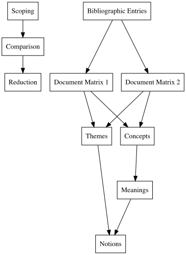

```{r setup, include=FALSE}
knitr::opts_chunk$set(
  echo = FALSE, # By default, hide code; set to TRUE to see code
  fig.pos = 'th', # Places figures at top or here
  out.width = '100%', dpi = 300, # Figure resolution and size
  fig.env="figure"
) # Latex figure environment

# install.packages("bibliometrix")
library(bibliometrix)

options(knitr.table.format = "latex") # For kable tables to write LaTeX table directly
```

```{r, include=F, warning=F}
## set up, load libraries
library(dplyr)
library(readtext)
library(tidyverse)
library(here)
library(gt)
library(ggplot2)
library(dplyr)
library(knitr)
library(kableExtra)
here::i_am("analysis1.Rmd")
```

\newpage

# Abstract

In discussions of racism across the sciences, medicine, and technology are important critiques of dominant ideas and practices.
Dominant ideas are artifacts of the historical foundations of a discipline, notable in references to “founding fathers” and a discipline’s foundational theories and beliefs.
Dominant practices, in the more contemporary sense, are modern representations of the professional priorities resulting from a discipline’s dominant ideas – which often serve to maintain a status quo.
In this article, the authors will employ mixed methodologies to examine how critically oriented scholars have challenged dominant ideas and practices in relation to racism in STEM (science, technology, engineering, and mathematic.s).
In doing so, the authors develop a framework and critical data scientific method to highlight varying levels and typologies of racism, as well as historical patterns of white racial violence in both theory and practice.

*Keywords*: racism, STEM, citation analysis, synthesis, race and ethnicity

\newpage

# Introduction

A global network of academics have identified how racism deeply impacts the well-being of communities, and the families and individuals that make up those communities.
As these scholars increasingly cross disciplinary boundaries to make sense of how racism is both studied and understood in different contexts and across various ecosystems, overwhelming evidence is generated to show racism's widespread impact.
This interdisciplinary body of scholarship not only identifies how racism holds consequences that are unique to each of the contexts in which racists attitudes and actions manifest, they also frame racism's similarities across social and political boundaries.

In some cases, individual perspectives (a single person's experience) around racism, what Bonilla-Silva refers to as "psychological phenomena" [@bonilla1997rethinking] and Shiao & Woody as "individual attitudes" [@shiao2021] are differentiated from two other perspectives identified: cultural perspectives and structural perspectives.
These perspectives present insights into the varied meanings that scholars may attribute to racism through empirical studies in the scholarly literature.
These meanings that scholars attribute to racism across contexts is informed by a constantly evolving set of dynamic indicators which change as new laws, policies, and systems are developed.
Many of the studies extend the general understanding of racism while also providing acute insights into different settings which make up the set of indicators, and contribute to efforts to further combat racism.

Given these considerations, our study aims to answer the following question: What is the state of the intellectual structure and emerging notions in research on racism in science, technology, engineering, and mathematics?

# Theoretical Framework

Notably, in their work, [@shiao2021] make note that the the "decision to connect concepts across the divide between comparative ethnicity and critical race theory may be controversial, but [they] find the general terminology of comparativists to be helpful for differentiating among uses of racism as structure and integrating the historical and group-specific analyses of U.S. critical race scholars" (p. ??).

“This inequality is built into the infrastructure of our country and has formed the foundation for structural racism—a system that privileges White people and results in intentional disadvantage for Black Americans.
These inequalities negatively impact the lives of Black people in a number of ways, including where they live; the education they receive; their employment and economic opportunities, access to child care, mental and physical health outcomes, and political standing and power; and the way they are treated in our systems of law and justice” [@lloyd2021family, p. 2].

"The analytical lens I use to frame their narratives, as well as the national data, is an intersectional feminist one that recognizes the multiplicity of not only people’s identities and experiences but also institutionalized hierarchies of power such as race and gender, as well as stratified and segmented labor structure" [@nzinga2020lean, p. 11].

[@shiao2021]'s "three meanings of racism expand on @bonilla1997rethinking's distinction between conceptualizations of racism as (1) an “ultimately psychological phenomenon,” (2) the “cultural processes [of an] all powerful ideology,” and (3) “the foundation or structure of the social system” by observing that sociologists typically conceptualize each meaning in less restrictive terms.

Two frameworks were used to guide the conceptual replication and analysis for the study.

+-----------------------------+------------------------------------------------+
| **Bonilla-Silva (1997)**    | **Shiao and Woody (2021)**                     |
+=============================+================================================+
| (1) Psychological phenomena | (1) Individual Attitudes                       |
+-----------------------------+------------------------------------------------+
| (2) Cultural processes      | (2) Cultural schema                            |
+-----------------------------+------------------------------------------------+
| (3) Social structure        | (3$_1$) Structure: Pre-existing conditions     |
+-----------------------------+------------------------------------------------+
|                             | (3$_2$) Structure: Create or maintain inequity |
+-----------------------------+------------------------------------------------+
|                             | (3$_3$) Structure: Cultural mobilization       |
+-----------------------------+------------------------------------------------+
|                             | (3$_4$) Structure: Racial dominance            |
+-----------------------------+------------------------------------------------+

: **Table 1**. Frameworks on the conceptualization and meaning of racism

# Methods and Data

We report findings from a conceptual replication of Shiao and Woody's (2021) study, The Meaning of `Racism', which examines three constructs that frame sociologists' use of the term ``racism.'' We use a quantitative historical lens to examine the framework's mapping on to racism-related research across the various science, technology, engineering, and mathematics (STEM) sub-disciplines. We map the intellectual structure of racism-focused research in STEM and STEM education journal articles and model similarities across database samples. Results indicate that research on racism in the STEM disciplines varies by ego-centric network but not necessarily by associated content. Despite the charge to examine more systemic forms of racism, the samples are primarily inclusive of research on two of the three constructs: individual attitudes and cultural schema. Three distinct citation-based communities were identified across samples. There is a change in the variance of the network citation metrics when themes are varied. We discuss the need for more empirical studies on the structural conceptions of racism and present a model of a subgroup of highly-networked authors.

## Methods

This study is motivated, in part, by the work of [@shiao2021] who discuss the various meanings of racism in sociological journal content.
For the purpose of this study, our team sought to make sense of the nature of this intellectual structure in STEM, and the various concepts and themes that are situated within this structure.
We integrate systematic review techniques with computational methods to generate the methods for the study.
The systematic review process builds on qualitative meta-synthesis techniques, as well as content and thematic analysis.
The computational methods follow the general scientific mapping workflow for working with large sets of citations data.

### Analytic framework

The analytic framework for this study was an iterative process that included elements from cliometric analytic methods [@aria2017bibliometrix] and qualitative metasynthesis [@thunder2016].

\newpage

{width="50%"}

## Data

### Scoping and comparison

An iterative scoping process was followed to make sense of the various databases and document structures.
The comparisons that followed were used to differentiate the contents of each potential data set.
Four databases were used to identify the possible collections of sources, and to compare the various results obtained.
Using multiple databases provides a more complete comparative picture of the available literature, as each database has different coverage and indexing practices.
This approach also presents an opportunity to examine differences across variations in terminology.

*EBSCO*. As one of the leading providers of research materials, EBSCO (Elton B. Stephens Company) initially sold magazines and military supplies but has now become one o the largest providers of research databases for librareis and academic institutions.
For this study, a subset of databases were selected that followed the work of other scholars [@thunder2016].
The databases were: Academic Search Premier, Social Sciences Full Text (H. W. Wilson), Education Research Complete, ERIC, and APA PsychArticles and APA PsychInfo Collection).
For example, ERIC (Education Resources Information Center) is a specialized database for education research, providing access to over 1.6 million texts related to all aspects of education.
It is sponsored by the U.S.
Department of Education and is considered the largest database for education literature.

*Scopus.* Scopus is one of the leading abstract and citation database that covers multiple academic fields and is considered as a comprehensive selection for academic researchers.
It covers scientific journals, books, conference proceedings across various areas of study.
It provides journal metrics and advanced search capabilities that can be used to identify specific areas of study.
Scopus is also integrated with other research tools and software to incorporate large-scale analysis.

*Google Scholar*.
As a part of Google's broader universe, Google Scholar is one of the most widely used free academic search engines.
The search engine indexes a range of scholarly literature across multiple disciplines and does not include a peer review process for inclusion, unlike the other search engines.
As a result, it is considered one of the broader academic search engines that contains one of the largest collections of scholarly materials.

*Web of Science (WoS)* is a comprehensive and highly respected citation database used for scholarly research.
It is one of the main databases used to identify and compare collections of citations and bibliographic sources.
Given the conceptual replication method selected for this study, we continued by using the Web of Science Core Collection of cliometric data.
This decision provided us with an opportunity to understand differences across disciplinary boundaries despite the increasingly interdisciplinary nature of the research on racism in STEM.

\newpage

Some text goes here.

Table: **Table 2**.

:   Results of title keyword search[^1]

[^1]: Reported results obtained on July 16, 2024; search for titles containing keyword patterns.

+---------------+------------+--------------------+------------+--------------------+
| **Keyword**   | **EBSCO**  | **Google Scholar** | **Scopus** | **Web of Science** |
+===============+:==========:+:==================:+:==========:+:==================:+
| anti-racism   | 381        | 3,420              | 685        | 592                |
+---------------+------------+--------------------+------------+--------------------+
| anti-racist   | 427        | 3,620              | 826        | 685                |
+---------------+------------+--------------------+------------+--------------------+
| race          | 44,057     | \~313,000          | 65,203     | 69,537             |
+---------------+------------+--------------------+------------+--------------------+
| racial        | 24,467     | \~212,000          | 39,930     | 41,527             |
+---------------+------------+--------------------+------------+--------------------+
| racialization | 519        | 2,740              | 1,108      | 1,077              |
+---------------+------------+--------------------+------------+--------------------+
| racialized    | 958        | \~5,600            | 1,863      | 2,120              |
+---------------+------------+--------------------+------------+--------------------+
| racism        | 8,669      | \~99,500           | 11,418     | 10,674             |
+---------------+------------+--------------------+------------+--------------------+
| racist        | 1,965      | \~15,100           | 2,170      | 1,906              |
+---------------+------------+--------------------+------------+--------------------+

\newpage

**PRISMA Flow Diagram**

The protocol outlined in the PRISMA [@prisma2009] flow diagram was modified to examine the reduction of records across the two sets.
This reduction method integrated a critical analysis of data loss and considered the various ways that contemporary methods may not include specific articles.
Each of these steps is outlined in three section.
The first of these sections focuses on the reduction methods used to generate the final two data sets for the study.
Then a discussion of the inclusion criteria (IC) and exclusion criteria (EC) is discussed.
The research categories and counts of articles in each of these categories across the two data sets is then outlined.

### Reduction

Data reduction took place in three steps.
The first reduction of data occurred in the scoping process where articles were reviewed for containing complete bibliometric records.
In this step, JSON files of the citation records were entered into the Quanteda [@quanteda] R/Posit software package which summarized the sources of any incomplete records.
The second reduction of data occurred in the comparison step where any results that were returned which did not fit the requirements outlined in the inclusion and exclusion criteria (see @table) following traditional bibliometric analysis methods were excluded.
The third and final reduction of data occurred in the comparison step where articles were reviewed for their fit within the goals of the study.
In this step, if any articles were not found during the initial two steps and any ancillary results that were returned were excluded.
This resulted in a set of bibliometric records across the two initial samples for the study.
A third sample was generated by integrating the two samples obtained from the analysis of records from STEM education journals and those records from STEM journals; the difference between these two cases is noted in the @table below.

\newpage

### Inclusion and exclusion criteria

**Table: Table 3.**

+------------------------+---------+-------------------------------------------------------------------------------------------------------------------------------------------------+
| Criteria               | Code    | Criteria                                                                                                                                        |
+========================+=========+=================================================================================================================================================+
| **Inclusion criteria** | IC1     | Article contains keyword pattern in either the title (TI), abstract (AB), or author keywords (DE)                                               |
+------------------------+---------+-------------------------------------------------------------------------------------------------------------------------------------------------+
|                        | IC2     | Article published before 2024                                                                                                                   |
+------------------------+---------+-------------------------------------------------------------------------------------------------------------------------------------------------+
|                        | IC3     | Article originally written in English                                                                                                           |
+------------------------+---------+-------------------------------------------------------------------------------------------------------------------------------------------------+
|                        | IC4     | Article is a peer-reviewed journal article                                                                                                      |
+------------------------+---------+-------------------------------------------------------------------------------------------------------------------------------------------------+
|                        | IC5     | Article problem, purpose, or core question(s) center on the topical subjects of the analysis as opposed to only mentioning author keywords (DE) |
+------------------------+---------+-------------------------------------------------------------------------------------------------------------------------------------------------+
| **Exclusion criteria** | EC1     | Article does constitute a complete citation record                                                                                              |
+------------------------+---------+-------------------------------------------------------------------------------------------------------------------------------------------------+
|                        | EC2     | Article contained ancillary content that is not focused on a clear and related research question                                                |
+------------------------+---------+-------------------------------------------------------------------------------------------------------------------------------------------------+

: Inclusion and exclusion criteria for the study

\newpage

| Research category                 |     M1 |     M2 |
|-----------------------------------|-------:|-------:|
|                                   | n($%$) | n($%$) |
| Education/Educational Research    |        |        |
| Education Scientific Discipline   |        |        |
| Public Health                     |        |        |
| Ethnic Studies                    |        |        |
| Sociology                         |        |        |
| Women's Studies                   |        |        |
| Social Science Other Topics       |        |        |
| Government Law                    |        |        |
| Social Psychology                 |        |        |
| Environmental Sciences Ecology    |        |        |
| Science Technology Other Topics   |        |        |
| Educational Psychology            |        |        |
| Interdisciplinary Social Sciences |        |        |
| Political Science                 |        |        |
| Health Care Sciences Services     |        |        |
| Multidisciplinary Psychology      |        |        |
| Multidisciplinary Sciences        |        |        |
| Urban Studies                     |        |        |
| Chemistry Multidisciplinary       |        |        |
| Engineering Multidisciplinary     |        |        |
| Geography                         |        |        |
| History                           |        |        |
| Psychology Developmental          |        |        |
| Other                             |        |        |
| Total                             |        |        |

: **Table 3**. : WoS results by research category for the study samples

\newpage

### Bibliometric entries

```{r, include=F}
### Load and convert data
# load wos database results
edrecords <- readtext(here("final-sample-ed.txt"))
# https://www.webofscience.com/wos/woscc/summary/331dedce-0c5c-40cd-b63e-734077ea3736-f840d6cf/relevance/1

stemrecords <- readtext(here("final-sample-stem.txt"))
# https://www.webofscience.com/wos/woscc/summary/507ef07d-4440-43c5-a139-c3148bf75a7f-f8416bcd/relevance/1

combined <- rbind(edrecords, stemrecords)

# convert  file to a bibliometric df
M1 <- convert2df(file=edrecords, dbsource= "wos", format= "plaintext")
M2 <- convert2df(file=stemrecords, dbsource= "wos", format= "plaintext")
M3 <- convert2df(file=combined, dbsource= "wos", format= "plaintext")
```

```{r, include=F, eval=F}

# We used the `duplicatedMatching()` function and [code suggestion](https://rdrr.io/github/massimoaria/bibliometrix/man/duplicatedMatching.html) to test for and remove any duplicate records in the data. When duplicate records are noted, the data new data frame is used as the main object.

M1_dup <- duplicatedMatching(M1, Field = "ID", exact=FALSE, tol = 0.95)
dim(M1)
dim(M1_dup)
  
M2_dup <- duplicatedMatching(M2, Field = "ID", exact=FALSE, tol = 0.95)
dim(M2)
dim(M2_dup)

M3_dup <- duplicatedMatching(M3, Field = "TI", exact=FALSE, tol = 0.95)
dim(M3)
dim(M3_dup)

# the package developer noted that when using `duplicatedMatching` we get missing data that is required later in the analysis. I have worked around this issue by changing the Field from "TI" to "ID". While this tempoararily supports the analysis, a fix should be found to retain the bibliometric data from the ID columns as downloaded from WoS.

# There was an issue with the code, so it was fixed using the `janitor()` functions.
library(janitor)
compare_df_cols(M1, M1_dup)
compare_df_cols(M2, M2_dup)
compare_df_cols(M3, M3_dup)

# in an earlier analysis, a column was added to the data sets (CR_SO)
# M1_dup <- M1_dup %>% remove(CR_SO) %>% as.data.frame()
# M2_dup <- M2_dup %>% remove(CR_SO) %>% as.data.frame()
```

\newpage

+--------------+--------+---------+--------------+--------+---------+--------------+
| Country      | M1     |         |              | M2     |         |              |
+==============+========+=========+==============+========+=========+==============+
|              | *Rank* | *Count* | *% of total* | *Rank* | *Count* | *% of total* |
|              |        |         |              |        |         |              |
|              |        |         | (n = 474)    |        |         | (n = ???)    |
+--------------+--------+---------+--------------+--------+---------+--------------+
| USA          | 1      | 352     |              |        |         |              |
+--------------+--------+---------+--------------+--------+---------+--------------+
| England      | 2      | 35      |              |        |         |              |
+--------------+--------+---------+--------------+--------+---------+--------------+
| Canada       | 3      | 31      |              |        |         |              |
+--------------+--------+---------+--------------+--------+---------+--------------+
| Australia    | 4      | 19      |              |        |         |              |
+--------------+--------+---------+--------------+--------+---------+--------------+
| Brazil       | 5      | 7       |              |        |         |              |
+--------------+--------+---------+--------------+--------+---------+--------------+
| Germany      | 6      | 6       |              |        |         |              |
+--------------+--------+---------+--------------+--------+---------+--------------+
| Israel       | 7      | 5       |              |        |         |              |
+--------------+--------+---------+--------------+--------+---------+--------------+
| Ireland      | 8      | 4       |              |        |         |              |
+--------------+--------+---------+--------------+--------+---------+--------------+
| Spain        |        | 4       |              |        |         |              |
+--------------+--------+---------+--------------+--------+---------+--------------+
| India        | 9      | 3       |              |        |         |              |
+--------------+--------+---------+--------------+--------+---------+--------------+
| Mexico       |        | 3       |              |        |         |              |
+--------------+--------+---------+--------------+--------+---------+--------------+
| Norway       |        | 3       |              |        |         |              |
+--------------+--------+---------+--------------+--------+---------+--------------+
| China        |        | 3       |              |        |         |              |
+--------------+--------+---------+--------------+--------+---------+--------------+
| South Africa |        | 3       |              |        |         |              |
+--------------+--------+---------+--------------+--------+---------+--------------+

: Publication count and rank by country

\newpage

## Database summaries

Each database, $M$, included a different number of observations but a total of 61 variables.
A matching method was used to identify and remove all duplicate records.
In our coding schema for the reduction, when duplicate records were noted, a new data frame was generated and used as the main object.

### Document Matrix 1

Document matrix 1 includes the records from education journals.

### Document Matrix 2

Document matrix 2 includes those records from STEM and non-education journals.

# Results and Analysis

Descriptive results for each database is provided in Table 3.
M$_3$ is the merged data from M$_1$ and M$_2$.

| **Database** | **Complete Records** | **Columns** |  **Label**  |
|:-------------|:--------------------:|:-----------:|:-----------:|
| M$_1$        |         278          |     61      |  edrecords  |
| M$_2$        |         132          |     61      | stemrecords |
| M$_3$        |         351          |     61      |  combined   |

:   **Table 3**.
    Database record counts and labels.

# Discussion

# Conclusion

In this paper, we conducted a conceptual replication (Cite) of Shiao and Woody’s 2021 study on the various meanings of racism described by scholars in the sociology of race and ethnicity.
The replication is conceptual in the sense that we primarily utilized the frameworks to attend to the various meanings of racism identified in the article and we employed a different set of analytic methods and provided a descriptive framework for a critical data scientific method.
Our research explorations included peer-reviewed scholarships across the related but distinct research published in journals focused on STEM education and those published in STEM journals.

\newpage

# References
